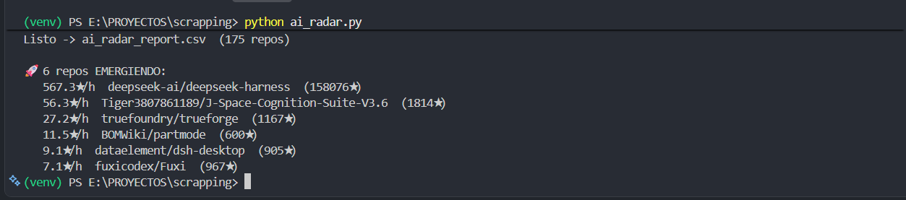

# 🛰️ GitHub AI Radar

Detects **emerging AI repositories** on GitHub and measures their *momentum*
(stars gained per hour between runs) to catch them **before** they blow up in
popularity.

In an ecosystem where hundreds of AI tools ship every week, knowing which ones
are growing fast — not which are already famous — is information that has value.
This project turns that signal into a clean, actionable CSV **and a live dashboard**.

[](https://github.com/BerniUCb/github-ai-radar/actions/workflows/radar.yml)

**🔗 Live dashboard: https://berniucb.github.io/github-ai-radar/** — refreshed every 6 hours by GitHub Actions.

## Example output



## What it does

1. **Extract** — queries the GitHub Search API filtering by AI *topics*
   (`llm`, `rag`, `ai-agents`, `mcp`, etc.) and recently created repos.
2. **Load** — saves a snapshot of each repo's stars with a timestamp in SQLite,
   building a history over time.
3. **Transform** — with **Polars**, compares the current run against the previous
   snapshot and computes stars gained and stars per hour (momentum).
4. **Report** — flags repos that break growth thresholds as `EMERGING`, exports a
   ranking to `ai_radar_report.csv` and a `data.json` feed for the dashboard.

The **Python engine** owns all data and logic; a **React dashboard** (Vite +
Tailwind) is a thin presentation layer that fetches `data.json` at runtime.

## Architecture

```
GitHub Search API  ──►  Extract  ──►  SQLite (historical snapshots)
                                          │
                                          ▼
                                  Transform (Polars)
                                  · stars_gained · stars_per_hour · emerging
                                          │
                          ┌───────────────┴───────────────┐
                          ▼                               ▼
                  ai_radar_report.csv              data.json (Export)
                                                        │
                                                        ▼
                                        React dashboard (Vite build) ──► docs/
                                                        │
                                                        ▼
                                                 GitHub Pages
```

It's a classic mini **ETL** pipeline: the value isn't in a one-off scrape, but in
running on a schedule and **accumulating history** — so momentum becomes more
accurate with every run.

## Project structure

Each ETL stage lives in its own module — `transform` is pure (no I/O), which
makes the momentum logic trivial to unit-test.

```
ai_radar/                 # Python data engine
  config.py               # topics, thresholds, paths
  extract.py              # GitHub Search API scraping
  storage.py              # SQLite snapshots (history)
  transform.py            # momentum calculation (pure, Polars)
  export.py               # builds data.json from the report + history
  cli.py                  # pipeline orchestration + argparse
web/                      # React dashboard (Vite + Tailwind)
  src/
    Dashboard.jsx         # layout shell (sidebar + top nav + router outlet)
    pages/                # Overview · RealTimeMomentum · StarGrowth · Repositories
    components/dashboard/ # StatCard, MomentumBars, TopicDonut, ScatterPlot, …
    lib/                  # data fetch + chart helpers
docs/                     # Vite build output, served by GitHub Pages
tests/                    # pytest (transform + cli)
.github/workflows/radar.yml   # scheduled scrape + build + git-scraping deploy
```

Run the tests:

```bash
pip install -r requirements-dev.txt
pytest
```

## Usage

```bash
pip install -r requirements.txt

python -m ai_radar                 # repos from the last 30 days
python -m ai_radar --days 14       # shorter window = "fresher"
python -m ai_radar --token <PAT>   # optional token: 5000 req/h vs 60
```

> The **first** run only stores the baseline snapshot (nothing to compare against
> yet). From the **second** run onward, it computes momentum and detects emerging
> repos. Run it on a cron every few hours for better results.

### Dashboard (React)

The Python run writes `web/public/data.json`; the React app reads it.

```bash
python -m ai_radar          # 1. generate data.json (run at least twice)
cd web && npm install
npm run dev                 # 2. dev server with hot reload
npm run build               # or: production build into ../docs
```

### GitHub token (optional but recommended)

Without a token: 60 requests/hour. With a free
[Personal Access Token](https://github.com/settings/tokens) (no special scopes),
you get 5000/hour. The script respects the rate limit automatically.

Pass it with `--token`, or — recommended — export it so it stays out of your
shell history and works in CI:

```bash
export GITHUB_TOKEN=<PAT>
python -m ai_radar            # picks up $GITHUB_TOKEN automatically
```

## Deploy (GitHub Actions + Pages)

The dashboard updates itself. [`.github/workflows/radar.yml`](.github/workflows/radar.yml)
runs the radar every 6 hours, **rebuilds the React app**, and uses
**git-scraping**: it commits the updated `radar.db` and built `docs/` back to the
repo. Persisting the snapshot DB between runs is what lets momentum accumulate
over time; GitHub Pages then serves `docs/`.

The workflow authenticates with the built-in `GITHUB_TOKEN` (5000 req/h) — no
secret to configure. One-time setup after the first push:

1. **Settings → Pages → Source:** *Deploy from a branch* → branch `main`, folder `/docs`.
2. **Settings → Actions → General → Workflow permissions:** *Read and write* (so the
   job can commit the refreshed data).

To run it locally on a schedule instead:

```cron
0 */6 * * * cd /path/github-ai-radar && GITHUB_TOKEN=<PAT> python -m ai_radar
```

## How it can be monetized

- **Weekly exports** of emerging AI repos sold on Gumroad / Lemon Squeezy to
  investors, developers, and tech newsletters.
- **API/dashboard** of AI trends as a micro-SaaS.
- **Custom trend-detection service** for funds or VCs.

## Stack

**Engine:** Python · Polars · SQLite · GitHub REST API
**Dashboard:** React · Vite · Tailwind CSS · lucide-react
**Ops:** GitHub Actions · GitHub Pages (git-scraping)

## Ideas for v2

- Enrich with commit/contributor data (development velocity).
- Anomaly detection to filter out star-farming (artificial growth).
- Email/Telegram alerts when a repo crosses the threshold.
- Filter for "hidden gems": repos under X stars but accelerating fast.
- Prune old snapshots to keep the committed `radar.db` small over time.

---

*Portfolio project — data collection and analysis pipeline.
Respects the [GitHub Terms of Service](https://docs.github.com/site-policy)
and API limits.*
